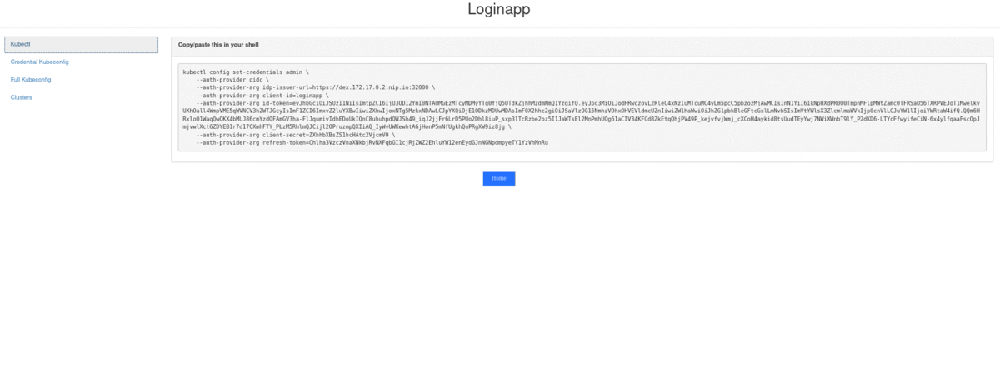

# Loginapp

**Web application for Kubernetes CLI configuration with OIDC**

[](https://quay.io/repository/fydrah/loginapp) [](https://codebeat.co/projects/github-com-fydrah-loginapp-master) [](https://www.codacy.com/app/fydrah/loginapp?utm_source=github.com&amp;utm_medium=referral&amp;utm_content=fydrah/loginapp&amp;utm_campaign=Badge_Grade) [](https://app.fossa.io/projects/git%2Bgithub.com%2Ffydrah%2Floginapp?ref=badge_shield)



## Usage

```shell

Perform configuration checks and run Loginapp.

Loginapp supports three configuration formats:
* Configuration file: '--config' flag
* Flags: '--oidc-xxx' flags for example
* Environment vars: each flag provides an environment var with
  'LOGINAPP_' prefix.
  Ex: '--oidc-client-secret' --> 'LOGINAPP_OIDC_CLIENT_SECRET'

Configuration precedence: flags > environment vars > configuration file

Usage:
  loginapp serve [flags]

Flags:
  -c, --config string                            Configuration file
  -h, --help                                     help for serve
  -l, --listen string                            Listen interface and port (default "0.0.0.0:8080")
      --metrics-port int                         Port to export metrics (default 9090)
  -n, --name string                              Application name. Used for web title. (default "Loginapp")
      --oidc-client-id string                    Client ID (default "loginapp")
      --oidc-client-redirecturl string           Redirect URL for callback. This must be the same than the one provided to the IDP. Must end with '/callback'
      --oidc-client-secret string                Client secret
      --oidc-crossclients strings                Issue token on behalf of this list of client IDs
      --oidc-extra-authcodeopts stringToString   K/V list of extra authorisation code to include in token request (default [])
      --oidc-extra-scopes strings                [DEPRECATED] List of extra scopes to ask. Use oidc.scopes option instead. Option will be removed in next release.
      --oidc-issuer-insecureskipverify           Skip issuer certificate validation (usefull for testing). It is not advised to use this option in production
      --oidc-issuer-rootca string                Certificate authority of the issuer
      --oidc-issuer-url string                   Full URL of issuer before '/.well-known/openid-configuration' path
      --oidc-offlineasscope                      Issue a refresh token for offline access
      --oidc-scopes strings                      List of scopes to request. Updating this parameter will override existing scopes. (default [openid,profile,email,groups])
  -s, --secret string                            Application secret. Must be identical across all loginapp server replicas (this is not the OIDC Client secret)
      --tls-cert string                          TLS certificate path
      --tls-enabled                              Enable TLS
      --tls-key string                           TLS private key path
      --web-assetsdir string                     Directory to look for assets, which are overriding embedded (default "/web/assets")
      --web-kubeconfig-defaultcluster string     Default cluster name to use for full kubeconfig output
      --web-kubeconfig-defaultnamespace string   Default namespace to use for full kubeconfig output (default "default")
      --web-mainclientid string                  Application client ID
      --web-mainusernameclaim string             Claim to use for username (depends on IDP available claims (default "email")
      --web-templatesdir string                  Directory to look for templates, which are overriding embedded (default "/web/templates")

Global Flags:
  -v, --verbose   Verbose output
```


## Configuration

```yaml
# Application name
# default: mandatory
name: "Kubernetes Auth"

# Bind IP and port (format: "IP:PORT")
# default: mandatory
listen: "0.0.0.0:5555"

# Application secret. Must be identical across
# all loginapp server replicas ( /!\ this is not the OIDC Client secret)
secret: REDACTED

# OIDC configuration
oidc:

  # Client configuration
  client:
    # Application ID
    # default: mandatory
    id: "loginapp"
    # Application Secret
    # default: mandatory
    secret: REDACTED
    # Application Redirect URL
    # must end with "/callback"
    # default: mandatory
    redirectURL: "https://127.0.0.1:5555/callback"

  # Issuer configuration
  issuer:
    # Location of issuer root CA certificate
    # default: mandatory if insecureSkipVerify is false
    rootCA: "example/ssl/ca.pem"
    # Issuer URL
    # default: mandatory
    url: "https://dex.example.com:5556"
    # Skip certificate validation
    # Default: false
    insecureSkipVerify: false

  # OIDC extra configuration
  extra:
    # OIDC Scopes in addition to
    # "openid", "profile", "email", "groups"
    # default: []
    scopes: []

    # Extra auth code options
    # Some extra auth code options are required for ADFS compatibility (ex: resource).
    # See: https://docs.microsoft.com/fr-fr/windows-server/identity/ad-fs/overview/ad-fs-scenarios-for-developers
    # default: {}
    authCodeOpts:
      resource: XXXXX

  # Enable offline scope
  # default: false
  offlineAsScope: true
  # Request token on behalf of other clients
  # default: []
  crossClients: []

# Tls support
tls:
  # Enable tls termination
  # default: false
  enabled: true
  # Certificate location
  # default: mandatory if tls.enabled is true
  cert: example/ssl/cert.pem
  # Key location
  # default: mandatory if tls.enabled is true
  key: example/ssl/key.pem

# Configure the web behavior
web:
  # ClientID to output (useful for cross_client)
  # default: value of 'oidc.client.id'
  mainClientID: loginapp
  # Claims to use for kubeconfig username.
  # default: email
  mainUsernameClaim: email
  # Kubeconfig output format
  kubeconfig:
    # Change default cluster for kubeconfig context
    # Default: first cluster name in `clusters`
    defaultCluster: mycluster
    # Change default namespace for kubeconfig contexts
    # Default: default
    defaultNamespace: default

# Metrics configuration
metrics:
  # Port to use. Metrics are available at
  # http://IP:PORT/metrics
  # default: 9090
  port: 9090

# Clusters list for CLI configuration
clusters:
  - name: mycluster
    server: https://mycluster.org
    certificate-authority: |
      -----BEGIN CERTIFICATE-----
      MIIC/zCCAeegAwIBAgIULkYvGJPRl50tMoVE4BNM0laRQncwDQYJKoZIhvcNAQEL
      BQAwDzENMAsGA1UEAwwEbXljYTAeFw0xOTAyMTgyMjA5NTJaFw0xOTAyMjgyMjA5
      NTJaMA8xDTALBgNVBAMMBG15Y2EwggEiMA0GCSqGSIb3DQEBAQUAA4IBDwAwggEK
      -----END CERTIFICATE-----
    insecure-skip-tls-verify: false
```

## Deployment

* Run the binary for [development purpose](#Dev)
* Deploy with [helm](./helm/loginapp):

    - Example for testing: see [./test/genconf.sh](./test/genconf.sh) file and [Dev](#Dev) section
    - [Prepare your deployment](./docs/deploy.md)

## Dev

###### Manage dependencies

Loginapp uses go modules to manage dependencies.

```shell
  # Retrieve dependencies (vendor)
  go mod vendor
```

###### Compile, configure and run

Configuration files are located in [example directory](./example/)

```shell
  $ make
```

Run also gofmt before any new commit:

```shell
  make gofmt
```

###### Dev env

Loginapp uses [kind](https://github.com/kubernetes-sigs/kind) and [skaffold](https://github.com/GoogleContainerTools/skaffold) for development environment.

Setup steps:

1. Launch a kind cluster:

    ```shell
    $ test/kubernetes/kindup.sh
    $ kubectl get node
    NAME                     STATUS   ROLES    AGE   VERSION
    loginapp-control-plane   Ready    master   25m   v1.17.0
    ```

2. Generate Dex & Loginapp certificates and configuration for the dev env:

    ```shell
    $ test/genconf.sh
    [...]
    Creating TLS secret for loginapp
    Generating dex and loginapp configurations
    [...]
    ```

3. Launch skaffold:

  * For local dev, launch just dex:

    ```shell
    # Deploy dex
    $ skaffold run -p dex
    ```

  * To test kubernetes deployment, launch dex and loginapp:

    ```shell
    # Deploy dex and loginapp
    $ skaffold run -p dex,loginapp
    ```

  * Test helm deployment:

    ```shell
    # Deploy dex and loginapp
    $ skaffold run -p helm
    ```

4. [local] Compile and run loginapp:

    ```shell
    $ make
    # A default configurationn is generated at test/generated/loginapp-config-manual.yaml
    $ ./build/loginapp -v serve [-c test/generated/loginapp-config-manual.yaml]
    [...]
    {"level":"info","msg":"export metric on http://0.0.0.0:9090","time":"2020-04-28T18:19:19+02:00"}
    {"level":"info","msg":"listening on https://0.0.0.0:8443","time":"2020-04-28T18:19:19+02:00"}
    [...]
    ```

5. Access loginapp UI:

    * For local dev, access URL will be: https://loginapp.127.0.0.1.nip.io:8443
    * For kubernetes test, access URL will be: https://loginapp.${NODE_IP}.nip.io:32001, where **NODE_IP** is the IP of the kind control plane container.

6. Default user/password configured by Dex is:

    * User: admin@example.com
    * Password: password


## Alternatives

Other projects performing OIDC authentication:

* [gangway](https://github.com/heptiolabs/gangway) (web)
* [kubelogin](https://github.com/int128/kubelogin) (cli)

## MISC

The code base of this repository uses some source code from the original
[dexidp/dex repository](https://github.com/dexidp/dex/tree/master/cmd/example-app).
